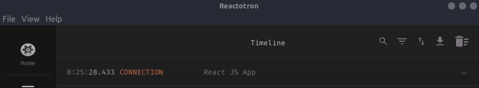
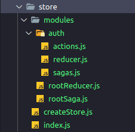

# Redux Saga + Reactotron setup

## Reactotron

O Reactotron é uma ótima ferramente para debugar projetos que usam Redux e Saga

### Setup

- Instalação: ```yarn add reactotron-react-js```

- Arquivo de configuração ([src/config/ReactotronConfig.js](src/config/ReactotronConfig.js)):

```js
import Reactotron from 'reactotron-react-js';

if (process.env.NODE_ENV === 'development') {
    const tron = Reactotron.configure().connect();

    tron.clear();

    console.tron = tron;
}
```

- importar arquivo de configuuração no [App.js](src/App.js)

```js
import './config/ReactotronConfig';
```

Feito isso, é esperado que o Reacotron consiga se conectar com a aplicação em ambiente de desenvolvimento


___

## Redux e Saga

No exemplo, configuraremos um store para autenticação, mas a criação de outros segue a mesma lógica.

Basicamente, existem *actions* que quando acionadas disparam *reducers* e *sagas*.

### Instalação

```bash
yarn add redux redux-saga react-redux reactotron-redux reactotron-redux-saga immer
```

> [immer](https://www.npmjs.com/package/immer) é opicional, para lidar com estados imutáveis mais facilmente

### Estrutura

Os arquivos ficarão no diretório [store](src/store) no seguinte esquema:



#### Reducer

O reducuer é uma função que recebe um estado e uma ação.  Retorna um novo estado de acordo com a ação.

[store/modules/auth/reducer.js](src/store/modules/auth/reducer.js)

```js
const INITIAL_STATE = {}

export default function auth(state = INITIAL_STATE, action) {
  switch (action.type) {
    default:
      return state;
  }
}
```

#### Saga

O sagas retorna o all,  que futuramente terá um array preenchido funções que serão executadas de acordo com a action disparada.

[store/modules/auth/sagas.js](src/store/modules/auth/sagas.js)

```js
import { all } from 'redux-saga/effects';

export default all([]);
```

#### Root reducers

O root reducer é responsável por reunir todos os reducers. No exemplo só temos o [auth](), mas se tivessemos mais bastaria adicionar ao objeto que o *combineReducers* recebe.

[store/modules/rootReducer.js](src/store/modules/rootReducer.js)

```js
import { combineReducers } from 'redux';

import auth from './auth/reducer';

export default combineReducers({
  auth,
});
```

#### Root saga

O root saga é responsável por reunir todos os sagas. No exemplo só temos o [auth](), mas se tivessemos mais bastaria adicionar ao array que o *all* recebe.

[store/modules/rootSaga.js](src/store/modules/rootSaga.js)

```js
import { all } from 'redux-saga/effects';

import auth from './auth/sagas';

export default function* rootSaga() {
  return yield all([auth]);
}
```

### Configuraçao do store

[store/index.js](src/store/index.js)

```js
import createSagaMiddleware from 'redux-saga';
import createStore from './createStore';

import rootReducer from './modules/rootReducer';
import rootSaga from './modules/rootSaga';

const sagaMonitor = process.env.NODE_ENV === 'development'
  ? console.tron.createSagaMonitor()
  :null;

const sagaMiddleware = createSagaMiddleware(sagaMonitor);

const middlewares = [sagaMiddleware];

const store = createStore(rootReducer, middlewares);

sagaMiddleware.run(rootSaga);

export default store;
```

[store/createStore.js](src/store/createStore.js)

```js
import { createStore, compose, applyMiddleware } from 'redux';

export default (reducers, middlewares) => {
  const enhancer = process.env.NODE_ENV === 'development'
    ? compose(
        console.tron.createEnhancer(),
        applyMiddleware(...middlewares)
    )
    : applyMiddleware(...middlewares);

  return createStore(reducers, enhancer);
};
```

#### Alterações na config do Reactotron

```js
import Reactotron from 'reactotron-react-js';
import { reactotronRedux } from 'reactotron-redux';
import reactotronSaga from 'reactotron-redux-saga';

if (process.env.NODE_ENV === 'development') {
    const tron = Reactotron.configure()
      .use(reactotronRedux())
      .use(reactotronSaga())
      .connect();

    tron.clear();

    console.tron = tron;
}
```

### Inserindo do projeto

Dentro do [App.js](src/App.js)

- Importar *Provider*

```js
import { Provider } from 'react-redux';
```

- Importar *store*

> É necessário importar o store depois do import do ReactotronConfig !!!

```js
import store from './store';
```

- Adicionar o *Provider* dentro do App com o store dentro

```js
function App() {
  return (
    <Provider store={store}>
      <h1>Hello World</h1>
    </Provider>
  );
}
```

Feito isso, tudo já está configurado para uso


